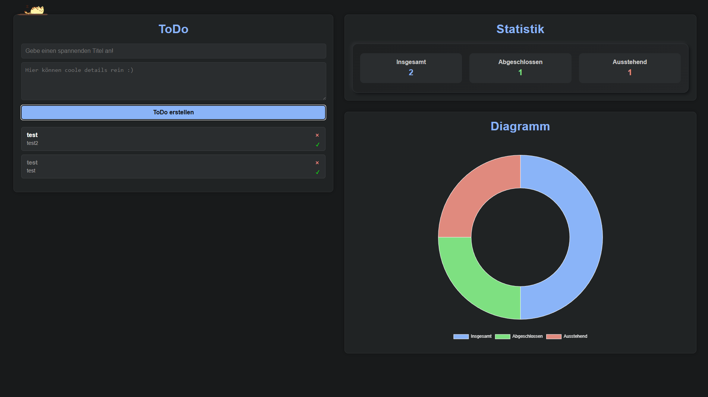
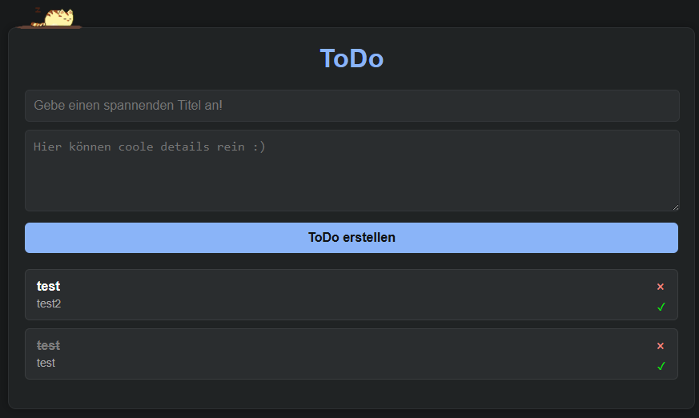
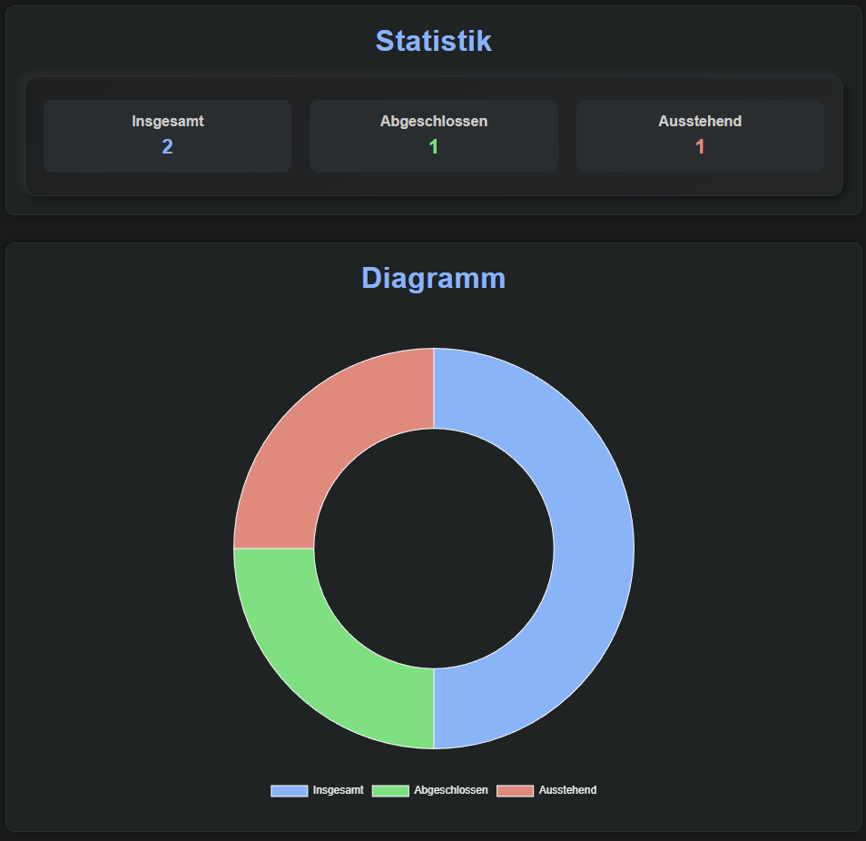

# 🐾 ToDoWeb — Dein smarter Aufgabenbegleiter  
_Ein modernes To-Do-Web-Dashboard mit Stil, Statistik & Diagramm_

---

## 🌟 **Über das Projekt**

**ToDoWeb** ist eine minimalistische, aber schicke To-Do-Webapp, die das Verwalten deiner Aufgaben angenehm macht.  
Mit einem dunklen, eleganten Design, lebendigen Farben und interaktiven Statistiken ist sie mehr als nur eine einfache Aufgabenliste.

---

## ✨ **Features**

✅ Aufgaben erstellen, löschen und abhaken  
📊 Automatische Statistik mit Fertig-/Ausstehend-Zähler  
🍩 Dynamisches Diagramm (Chart.js)  
💾 Lokale Speicherung (LocalStorage – keine Datenverluste!)  
🐱 Niedliche schlafende Katze auf deiner Aufgabenliste  
🎨 Dunkles, modernes Dashboard-Layout  

---

## 🖼️ **Screenshots**

| Aufgabenübersicht | Statistik & Diagramm |
|-------------------|----------------------|
|  |  |

---

## 🧠 **Technologien**

- **HTML5** – Struktur der App  
- **CSS3 / Flexbox / Grid** – modernes, responsives Layout  
- **JavaScript (Vanilla)** – Logik, LocalStorage & Interaktivität  
- **Chart.js** – animierte Diagramme  
- **Liebe zum Detail ❤️** – für das kleine Extra

---

